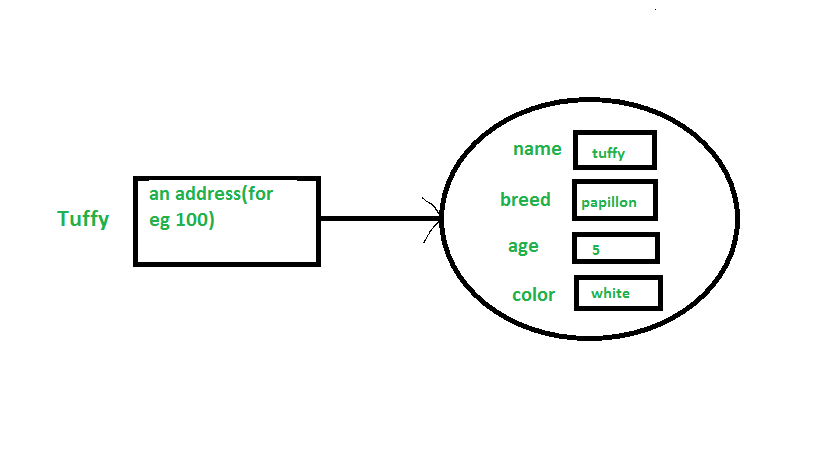
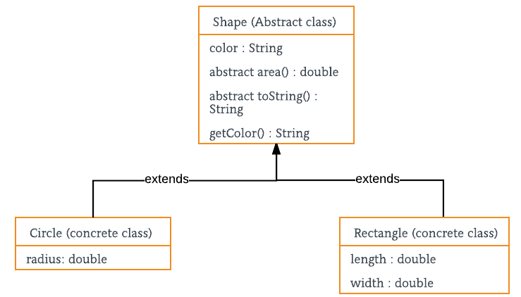

## Lecture_1
 
Introduction to Java Architecture: JDK, JRE, and JVM
Java is one of the most widely used programming languages in the world, known for its portability, scalability, and ease of use. Understanding its architecture is crucial for effectively developing and running Java applications. The Java architecture comprises three primary components: the Java Development Kit (JDK), the Java Runtime Environment (JRE), and the Java Virtual Machine (JVM). Each plays a distinct role in the lifecycle of a Java application.

1. Java Development Kit (JDK)
The Java Development Kit (JDK) is a software development kit used to develop Java applications. It provides the necessary tools and libraries to compile, debug, and execute Java programs. The JDK includes:

Compiler (javac): The compiler converts Java source code (.java files) into bytecode (.class files). Bytecode is a platform-independent code that can be executed by the JVM.
Java Runtime Environment (JRE): Included within the JDK, the JRE provides the libraries and the JVM required to run Java applications. While the JRE is essential for executing Java programs, it does not include development tools.
Development Tools: The JDK provides additional tools such as javadoc for generating documentation, javap for disassembling class files, and jar for packaging Java applications into JAR (Java ARchive) files.
Debugger (jdb): This tool helps developers diagnose and fix issues in their Java code by allowing them to set breakpoints, inspect variables, and control execution flow.
In essence, the JDK is intended for developers who need to create and test Java applications.

2. Java Runtime Environment (JRE)
The Java Runtime Environment (JRE) is a runtime environment that provides the resources needed to run Java applications. It is a part of the JDK but can also be installed separately. The JRE includes:

Java Virtual Machine (JVM): The core component responsible for executing Java bytecode. It interprets or compiles bytecode into machine code specific to the underlying hardware and operating system.
Standard Libraries: A set of pre-written classes and methods (e.g., java.lang, java.util, java.io) that developers can use to build Java applications. These libraries provide functionality for data structures, file handling, networking, and more.
Runtime Environment: Includes everything necessary to run Java applications, such as core libraries, Java class loaders, and garbage collection mechanisms.
The JRE is designed for users who want to run Java applications but do not need to develop or compile them.

3. Java Virtual Machine (JVM)
The Java Virtual Machine (JVM) is a crucial component of the Java architecture. It provides a platform-independent execution environment for Java bytecode. The key functions of the JVM include:

Bytecode Execution: The JVM reads and executes Java bytecode, which is a portable, intermediate representation of Java source code. This allows Java applications to run on any device or operating system that has a compatible JVM.
Memory Management: The JVM handles memory allocation and garbage collection. It manages the heap (where objects are allocated) and the stack (where method calls and local variables are stored).
Just-In-Time (JIT) Compilation: To improve performance, the JVM employs JIT compilation, which compiles bytecode into native machine code at runtime. This can lead to significant performance improvements over interpretation alone.
Class Loading: The JVM dynamically loads classes as needed. It uses class loaders to find and load class files into memory.
Exception Handling: The JVM manages exceptions and errors during runtime. It provides mechanisms for throwing, catching, and handling exceptions, ensuring that Java programs can recover from unexpected conditions.
Interaction Between JDK, JRE, and JVM
Development: When developers write Java code, they use the JDK, which includes the compiler (javac). The compiler converts the source code into bytecode.
Execution: To run the compiled bytecode, users need the JRE. The JRE contains the JVM, which executes the bytecode. The JVM converts the bytecode into machine code that can be understood by the hardware.
Runtime: During execution, the JVM manages memory, handles exceptions, and performs JIT compilation to optimize performance.
Classes and Objects in Java
A CLASS is a user defined blueprint or prototype from which objects are created.  It represents the set of properties or methods that are common to all objects of one type. In general, class declarations can include these components, in order: 

Modifiers: A class can be public or has default access 
class keyword: class keyword is used to create a class.
Class name: The name should begin with an initial letter (capitalized by convention).
Superclass(if any): The name of the class’s parent (superclass), if any, preceded by the keyword extends. A class can only extend (subclass) one parent.
Interfaces(if any): A comma-separated list of interfaces implemented by the class, if any, preceded by the keyword implements. A class can implement more than one interface.
Body: The class body surrounded by braces, { }.
CONSTRUCTORS : Constructors are used for initializing new objects. Fields are variables that provides the state of the class and its objects, and methods are used to implement the behavior of the class and its objects.

POINTS TO DISCUSS : Class , Abstract Class , Interface

An OBJECT is a basic unit of Object-Oriented Programming and represents real life entities.  A typical Java program creates many objects, which as you know, interact by invoking methods. 

 
An object consists of : 

State: It is represented by attributes of an object. It also reflects the properties of an object.
Behavior: It is represented by methods of an object. It also reflects the response of an object with other objects.
Identity: It gives a unique name to an object and enables one object to interact with other objects.

 
Declaring Objects (Also called instantiating a class)

 
Code Example for Practice : https://ide.geeksforgeeks.org/yK1v1b9KLa

Ways to create object of a class
Using new keyword
Using Class.forName(String className) method
Using clone() method
Deserialization
 

Topics to discuss :

Static keyword in Java (https://www.geeksforgeeks.org/static-keyword-java/)
Final keyword in Java (https://www.geeksforgeeks.org/final-keyword-in-java/)
Access Modifier : Defines access type of the method i.e. from where it can be accessed in your application. In Java, there 4 type of the access specifiers. 

public: accessible in all class in your application.
protected: accessible within the package in which it is defined and in its subclass(es)(including subclasses declared outside the package)
private: accessible only within the class in which it is defined.
default (declared/defined without using any modifier): accessible within same class and package within which its class is defined.
Object Oriented Programming (OOPs) Concept in Java

 
Object-oriented programming aims to implement real-world entities like inheritance, hiding, polymorphism etc in programming. The main aim of OOP is to bind together the data and the functions that operate on them so that no other part of the code can access this data except that function. 

Let us now discuss 4 pillars of OOPS:

Pillar 1: Abstraction

 
Data Abstraction is the property by virtue of which only the essential details are displayed to the user. The trivial or the non-essentials units are not displayed to the user. Ex: A car is viewed as a car rather than its individual components.

Code Example : https://ide.geeksforgeeks.org/btCYEwU3Mj

Point to discuss : Abstract classes and Abstract methods

Pillar 2: Encapsulation
Encapsulation is defined as the wrapping up of data under a single unit. It is the mechanism that binds together code and the data it manipulates. Another way to think about encapsulation is, it is a protective shield that prevents the data from being accessed by the code outside this shield. 

Code Example : https://ide.geeksforgeeks.org/wh3Iqv4eHx

 
Pillar 3: Inheritence 
Inheritance is an important pillar of OOP(Object-Oriented Programming). It is the mechanism in java by which one class is allowed to inherit the features(fields and methods) of another class. 

Types of Inheritance in Java

Single Inheritance : https://ide.geeksforgeeks.org/iXpFHkh4rz
Multilevel Inheritance : https://ide.geeksforgeeks.org/tbBVCp8wQn
Hierarchical Inheritance : https://ide.geeksforgeeks.org/EXeCyyqZgY
Multiple Inheritance : https://ide.geeksforgeeks.org/W161yoraTO
Hybrid Inheritance(Through Interfaces)
 

Pillar 4: Polymorphism
The word polymorphism means having many forms. In simple words, we can define polymorphism as the ability of a message to be displayed in more than one form. 

Types of polymorphism :

In Java polymorphism is mainly divided into two types: 

Compile-time Polymorphism : https://ide.geeksforgeeks.org/cijtDcYUT2
Runtime Polymorphism : https://ide.geeksforgeeks.org/4cgdWD1eJX
